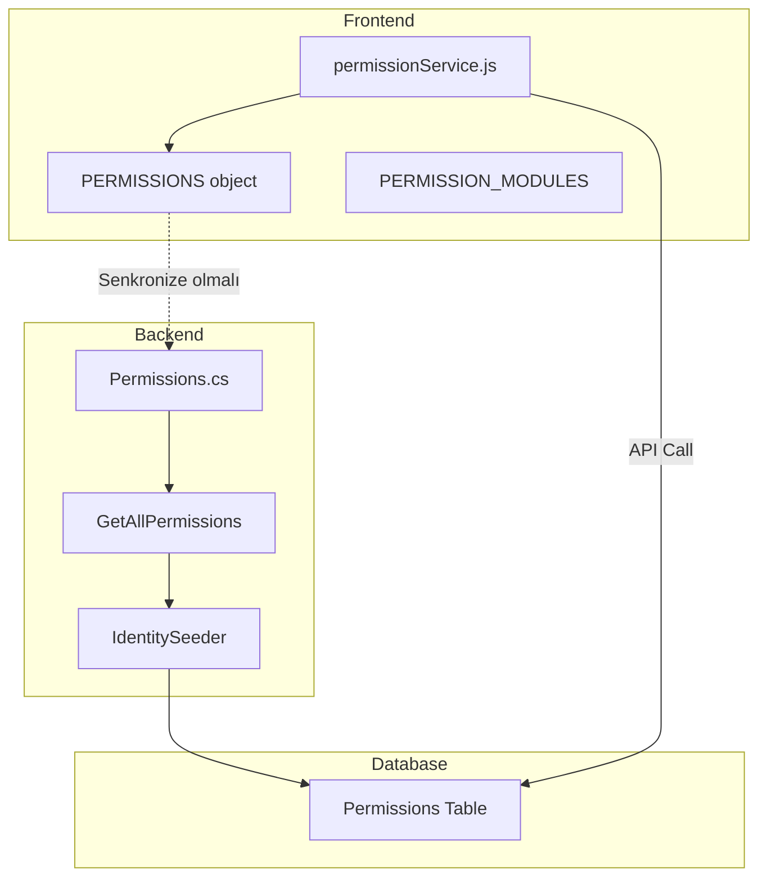

# Design Document: Frontend-Backend Permission Sync

## Overview

Bu tasarım, frontend'deki PERMISSIONS sabitleri ile backend'deki Permissions.cs arasındaki uyumsuzlukları giderir. Eksik izinler backend'e eklenir ve frontend sabitleri güncellenir. Ayrıca izin adlandırma standardı belirlenir.

## Architecture



## Components and Interfaces

### 1. Backend Permissions.cs Güncellemesi

Eksik izinler eklenir:

```csharp
#region Rapor İzinleri

public static class Reports
{
    // YENİ: Genel görüntüleme izni
    public const string View = "reports.view";

    public const string ViewSales = "reports.sales";
    public const string ViewInventory = "reports.inventory";
    public const string ViewCustomers = "reports.customers";
    public const string ViewFinancial = "reports.financial";
    public const string ViewWeight = "reports.weight";
    public const string Export = "reports.export";

    public static string[] All => new[] {
        View,  // YENİ
        ViewSales, ViewInventory, ViewCustomers,
        ViewFinancial, ViewWeight, Export
    };
}

#endregion

#region Log İzinleri

public static class Logs
{
    // YENİ: Genel görüntüleme izni
    public const string View = "logs.view";

    public const string ViewAudit = "logs.audit";
    public const string ViewError = "logs.error";
    public const string ViewSync = "logs.sync";
    public const string Export = "logs.export";

    public static string[] All => new[] {
        View,  // YENİ
        ViewAudit, ViewError, ViewSync, Export
    };
}

#endregion

#region Sistem Ayarları İzinleri

public static class Settings
{
    public const string View = "settings.view";
    public const string Update = "settings.update";
    // YENİ: Sistem seviyesi ayarlar
    public const string System = "settings.system";
    public const string ManagePayment = "settings.payment";
    public const string ManageSms = "settings.sms";
    public const string ManageEmail = "settings.email";

    public static string[] All => new[] {
        View, Update, System,  // System YENİ
        ManagePayment, ManageSms, ManageEmail
    };
}

#endregion
```

### 2. Frontend permissionService.js Güncellemesi

Eksik sabitler eklenir ve mevcut olanlar doğrulanır:

```javascript
export const PERMISSIONS = {
  // Reports - Güncellenmiş
  REPORTS_VIEW: "reports.view", // Backend'de VAR
  REPORTS_SALES: "reports.sales",
  REPORTS_INVENTORY: "reports.inventory",
  REPORTS_CUSTOMERS: "reports.customers",
  REPORTS_EXPORT: "reports.export",
  REPORTS_WEIGHT: "reports.weight",

  // Logs - Güncellenmiş
  LOGS_VIEW: "logs.view", // Backend'de VAR
  LOGS_AUDIT: "logs.audit",
  LOGS_ERROR: "logs.error",
  LOGS_EXPORT: "logs.export",

  // Settings - Güncellenmiş
  SETTINGS_VIEW: "settings.view",
  SETTINGS_UPDATE: "settings.update",
  SETTINGS_SYSTEM: "settings.system", // Backend'de VAR

  // Shipping - YENİ (Backend'de zaten var)
  SHIPPING_VIEW: "shipping.pending",
  SHIPPING_UPDATE_STATUS: "shipping.tracking",
  SHIPPING_TRACK: "shipping.ship",
  SHIPPING_WEIGHT_APPROVAL: "shipping.deliver",

  // ... diğer izinler
};
```

### 3. seed-rbac-data.sql Güncellemesi

Yeni izinler Permissions tablosuna eklenir:

```sql
-- Reports modülü - Genel görüntüleme izni
INSERT INTO Permissions (Name, DisplayName, Description, Module, SortOrder, IsActive, CreatedAt)
VALUES
('reports.view', 'Rapor Görüntüleme', 'Reports modülü için genel Görüntüleme yetkisi', 'Reports', 53, 1, GETUTCDATE());

-- Logs modülü - Genel görüntüleme izni
INSERT INTO Permissions (Name, DisplayName, Description, Module, SortOrder, IsActive, CreatedAt)
VALUES
('logs.view', 'Log Görüntüleme', 'Logs modülü için genel Görüntüleme yetkisi', 'Logs', 72, 1, GETUTCDATE());

-- Settings modülü - Sistem ayarları izni
INSERT INTO Permissions (Name, DisplayName, Description, Module, SortOrder, IsActive, CreatedAt)
VALUES
('settings.system', 'Sistem Ayarları', 'Settings modülü için Sistem yetkisi', 'Settings', 73, 1, GETUTCDATE());
```

### 4. İzin Adlandırma Standardı

| Katman      | Format               | Örnek        |
| ----------- | -------------------- | ------------ |
| Database    | lowercase.action     | reports.view |
| Backend C#  | PascalCase.Property  | Reports.View |
| Frontend JS | SCREAMING_SNAKE_CASE | REPORTS_VIEW |

### 5. İzin Eşleştirme Tablosu

| Frontend Constant | Backend Property  | Database Value  |
| ----------------- | ----------------- | --------------- |
| REPORTS_VIEW      | Reports.View      | reports.view    |
| REPORTS_SALES     | Reports.ViewSales | reports.sales   |
| LOGS_VIEW         | Logs.View         | logs.view       |
| LOGS_AUDIT        | Logs.ViewAudit    | logs.audit      |
| SETTINGS_SYSTEM   | Settings.System   | settings.system |

## Data Models

### Permissions Tablosu (Güncellenmiş)

Yeni eklenen izinler:

| Name            | DisplayName       | Module   |
| --------------- | ----------------- | -------- |
| reports.view    | Rapor Görüntüleme | Reports  |
| logs.view       | Log Görüntüleme   | Logs     |
| settings.system | Sistem Ayarları   | Settings |

## Correctness Properties

_A property is a characteristic or behavior that should hold true across all valid executions of a system-essentially, a formal statement about what the system should do. Properties serve as the bridge between human-readable specifications and machine-verifiable correctness guarantees._

### Property 1: Frontend-Backend Permission Value Match

_For any_ permission constant defined in frontend PERMISSIONS object, the corresponding value SHALL exist in backend Permissions.cs and database Permissions table.

**Validates: Requirements 1.2, 2.2, 3.2**

### Property 2: Unknown Permission Fail-Safe

_For any_ permission string not defined in backend Permissions.cs, the hasPermission check SHALL return false (deny access).

**Validates: Requirements 4.3**

### Property 3: Permission Naming Convention Compliance

_For any_ permission in the system:

- Database value SHALL be lowercase with dots (e.g., "reports.view")
- Frontend constant SHALL be SCREAMING_SNAKE_CASE (e.g., REPORTS_VIEW)
- Backend property SHALL be PascalCase (e.g., Reports.View)

**Validates: Requirements 6.1, 6.2, 6.3**

## Error Handling

| Senaryo                   | Davranış                       |
| ------------------------- | ------------------------------ |
| Frontend'de tanımsız izin | Console warning + false döndür |
| Backend'de tanımsız izin  | 403 Forbidden                  |
| Veritabanında izin yok    | Seeder otomatik ekler          |

## Testing Strategy

### Unit Tests

- Frontend PERMISSIONS object key-value doğrulama
- Backend Permissions.cs GetAllPermissions() çıktısı
- İzin adlandırma formatı kontrolü

### Integration Tests

- Frontend izin kontrolü → Backend API → Database
- Yeni izinlerle rol atama ve erişim testi

### Property-Based Tests

- Property 1: Tüm frontend izinlerini backend'de ara
- Property 2: Rastgele string'lerle hasPermission testi
- Property 3: Regex ile format doğrulama

**Test Framework**: Jest (Frontend), xUnit (Backend)
**PBT Library**: fast-check (JavaScript), FsCheck (C#)
**Minimum Iterations**: 100

### Validation Script

Frontend ve backend izinlerini karşılaştıran script:

```javascript
// scripts/validate-permissions.js
const frontendPermissions = Object.values(PERMISSIONS);
const backendPermissions = await fetch("/api/admin/permissions").then((r) =>
  r.json()
);

const mismatches = frontendPermissions.filter(
  (fp) => !backendPermissions.some((bp) => bp.name === fp)
);

if (mismatches.length > 0) {
  console.error("Permission mismatches:", mismatches);
  process.exit(1);
}
```
