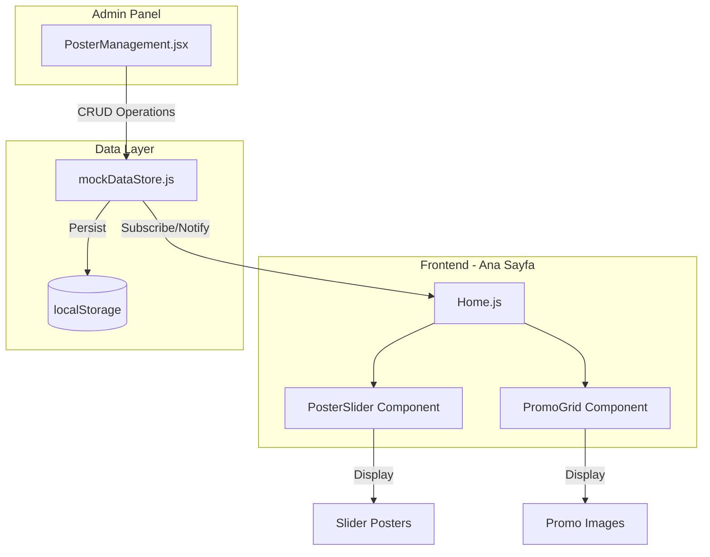

# Design Document: Homepage Poster Management

## Overview

Bu tasarım, e-ticaret sitesinin ana sayfasındaki poster/banner ve promosyon görsellerinin yönetimini kapsar. Sistem, admin panelinden poster ekleme/düzenleme/silme işlemlerini destekler ve ana sayfada otomatik dönen slider ile promosyon grid'i gösterir. Tüm veriler localStorage üzerinden mockDataStore servisi ile yönetilir.

## Architecture



## Components and Interfaces

### 1. mockDataStore.js - Poster Functions

```javascript
// Storage key
const STORAGE_KEYS = {
  posters: "mockStore_posters"
};

// Poster data structure
interface Poster {
  id: number;
  title: string;
  imageUrl: string;
  linkUrl: string;
  type: "slider" | "promo";
  displayOrder: number;
  isActive: boolean;
  createdAt: string;
  updatedAt: string;
}

// Functions to add
getPosters(): Poster[]           // Get active posters
getAllPosters(): Poster[]        // Get all posters (admin)
getPosterById(id): Poster        // Get single poster
createPoster(data): Poster       // Create new poster
updatePoster(id, data): Poster   // Update existing poster
deletePoster(id): {success: boolean}  // Delete poster
getSliderPosters(): Poster[]     // Get active slider posters sorted by displayOrder
getPromoPosters(): Poster[]      // Get active promo posters sorted by displayOrder
```

### 2. PosterManagement.jsx - Admin Component

Mevcut yapı korunacak, sadece API çağrıları mockDataStore'a yönlendirilecek:

```javascript
// Değişiklikler:
// - axios.get("/api/banners") → mockDataStore.getAllPosters()
// - axios.post("/api/banners", form) → mockDataStore.createPoster(form)
// - axios.put("/api/banners", form) → mockDataStore.updatePoster(form.id, form)
// - axios.delete(`/api/banners/${id}`) → mockDataStore.deletePoster(id)

// Yeni özellikler:
// - Boyut bilgisi gösterimi (Slider: 1200x400px, Promo: 300x200px)
// - Görsel önizleme ile aspect ratio kontrolü
```

### 3. Home.js - Homepage Component

```javascript
// Yeni state'ler
const [sliderPosters, setSliderPosters] = useState([]);
const [promoPosters, setPromoPosters] = useState([]);
const [currentSlide, setCurrentSlide] = useState(0);

// Poster yükleme
useEffect(() => {
  setSliderPosters(mockDataStore.getSliderPosters());
  setPromoPosters(mockDataStore.getPromoPosters());

  // Subscribe to changes
  const unsubPosters = mockDataStore.subscribe("posters", () => {
    setSliderPosters(mockDataStore.getSliderPosters());
    setPromoPosters(mockDataStore.getPromoPosters());
  });

  return () => unsubPosters();
}, []);

// Auto-rotation
useEffect(() => {
  if (sliderPosters.length <= 1) return;
  const timer = setInterval(() => {
    setCurrentSlide((prev) => (prev + 1) % sliderPosters.length);
  }, 5000);
  return () => clearInterval(timer);
}, [sliderPosters.length]);
```

### 4. PosterSlider Component (Inline in Home.js)

```jsx
// Slider section
<section className="mb-8">
  {sliderPosters.length > 0 ? (
    <div className="relative rounded-lg overflow-hidden">
      {/* Slider images */}
      <div className="relative h-[400px]">
        {sliderPosters.map((poster, index) => (
          <a
            key={poster.id}
            href={poster.linkUrl || "#"}
            className={`absolute inset-0 transition-opacity duration-500 ${
              index === currentSlide ? "opacity-100" : "opacity-0"
            }`}
          >
            
          </a>
        ))}
      </div>

      {/* Navigation dots */}
      {sliderPosters.length > 1 && (
        <div className="absolute bottom-4 left-1/2 transform -translate-x-1/2 flex gap-2">
          {sliderPosters.map((_, index) => (
            <button
              key={index}
              onClick={() => setCurrentSlide(index)}
              className={`w-3 h-3 rounded-full ${
                index === currentSlide ? "bg-white" : "bg-white/50"
              }`}
            />
          ))}
        </div>
      )}
    </div>
  ) : (
    // Default hero banner
    <div className="bg-gradient-to-r from-sky-400 to-indigo-600 rounded-lg p-8 text-white">
      <h1 className="text-3xl font-bold">Bugün ne sipariş ediyorsun?</h1>
      <p className="mt-2">Hızlı teslimat — Taze ürünler — Güvenli ödeme</p>
    </div>
  )}
</section>
```

### 5. PromoGrid Component (Inline in Home.js)

```jsx
// Promo section
{
  promoPosters.length > 0 && (
    <section className="mb-8">
      <h2 className="text-xl font-semibold mb-4">Kampanyalar</h2>
      <div className="grid grid-cols-2 md:grid-cols-4 gap-4">
        {promoPosters.map((promo) => (
          <a
            key={promo.id}
            href={promo.linkUrl || "#"}
            className="rounded-lg overflow-hidden shadow-md hover:shadow-lg transition-shadow"
          >
            
          </a>
        ))}
      </div>
    </section>
  );
}
```

## Data Models

### Poster Entity

```typescript
interface Poster {
  id: number; // Unique identifier
  title: string; // Poster title (required)
  imageUrl: string; // Image URL (required)
  linkUrl: string; // Click destination URL (optional)
  type: "slider" | "promo"; // Poster type
  displayOrder: number; // Sort order (lower = first)
  isActive: boolean; // Active/inactive status
  createdAt: string; // ISO date string
  updatedAt: string; // ISO date string
}
```

### Default Posters

```javascript
const defaultPosters = [
  {
    id: 1,
    title: "Taze Doğal Ürünler",
    imageUrl: "/images/taze-dogal-urunler.png",
    linkUrl: "/kategori/meyve-ve-sebze",
    type: "slider",
    displayOrder: 1,
    isActive: true,
    createdAt: new Date().toISOString(),
    updatedAt: new Date().toISOString(),
  },
  {
    id: 2,
    title: "Gölköy Banner",
    imageUrl: "/images/golkoy-banner-1.png",
    linkUrl: "/kampanyalar",
    type: "slider",
    displayOrder: 2,
    isActive: true,
    createdAt: new Date().toISOString(),
    updatedAt: new Date().toISOString(),
  },
  {
    id: 3,
    title: "İlk Alışveriş İndirimi",
    imageUrl: "/images/ilk-alisveris-indirim-banner.png",
    linkUrl: "/kampanyalar/ilk-alisveris",
    type: "slider",
    displayOrder: 3,
    isActive: true,
    createdAt: new Date().toISOString(),
    updatedAt: new Date().toISOString(),
  },
  {
    id: 4,
    title: "Meyve Reyonu",
    imageUrl: "/images/meyve-reyonu-banner.png",
    linkUrl: "/kategori/meyve-ve-sebze",
    type: "promo",
    displayOrder: 1,
    isActive: true,
    createdAt: new Date().toISOString(),
    updatedAt: new Date().toISOString(),
  },
  {
    id: 5,
    title: "Özel Fiyat Köy Sütü",
    imageUrl: "/images/ozel-fiyat-koy-sutu.png",
    linkUrl: "/urun/koy-sutu",
    type: "promo",
    displayOrder: 2,
    isActive: true,
    createdAt: new Date().toISOString(),
    updatedAt: new Date().toISOString(),
  },
  {
    id: 6,
    title: "Temizlik Malzemeleri",
    imageUrl: "/images/temizlik-malzemeleri.png",
    linkUrl: "/kategori/temizlik",
    type: "promo",
    displayOrder: 3,
    isActive: true,
    createdAt: new Date().toISOString(),
    updatedAt: new Date().toISOString(),
  },
  {
    id: 7,
    title: "Taze Günlük Lezzetli",
    imageUrl: "/images/taze-gunluk-lezzetli.png",
    linkUrl: "/kategori/sut-ve-sut-urunleri",
    type: "promo",
    displayOrder: 4,
    isActive: true,
    createdAt: new Date().toISOString(),
    updatedAt: new Date().toISOString(),
  },
];
```

## Correctness Properties

_A property is a characteristic or behavior that should hold true across all valid executions of a system-essentially, a formal statement about what the system should do. Properties serve as the bridge between human-readable specifications and machine-verifiable correctness guarantees._

### Property 1: Poster CRUD Persistence

_For any_ poster data that is created, updated, or deleted via mockDataStore, the change SHALL be persisted to localStorage under the "mockStore_posters" key and retrievable after page refresh.
**Validates: Requirements 1.1, 2.2, 3.2, 7.1, 9.1**

### Property 2: Poster Validation

_For any_ poster submission, if the title is empty or the imageUrl is empty, the system SHALL reject the submission and not save to localStorage.
**Validates: Requirements 1.2**

### Property 3: Poster Type Validation

_For any_ poster, the type field SHALL only accept values "slider" or "promo", and any other value SHALL be rejected.
**Validates: Requirements 1.4**

### Property 4: Edit Preserves ID

_For any_ poster edit operation, the poster's ID SHALL remain unchanged before and after the update.
**Validates: Requirements 2.4**

### Property 5: Delete Removes Poster

_For any_ poster that is deleted, calling getPosterById with that ID SHALL return undefined, and the poster SHALL not appear in getAllPosters().
**Validates: Requirements 3.2**

### Property 6: Real-time Sync via Subscription

_For any_ poster modification (create, update, delete), all subscribed callbacks SHALL be invoked, allowing components to update their state.
**Validates: Requirements 3.4, 7.3**

### Property 7: Active Filtering

_For any_ set of posters, getSliderPosters() and getPromoPosters() SHALL only return posters where isActive is true.
**Validates: Requirements 4.1, 8.2**

### Property 8: Auto-rotation Timing

_For any_ slider with more than one poster, the currentSlide index SHALL increment (wrapping to 0) every 5 seconds while the component is mounted.
**Validates: Requirements 4.2**

### Property 9: Navigation Dots Conditional Rendering

_For any_ slider, navigation dots SHALL only be rendered when there are 2 or more active slider posters.
**Validates: Requirements 4.3**

### Property 10: Display Order Sorting

_For any_ set of posters, getSliderPosters() and getPromoPosters() SHALL return posters sorted by displayOrder ascending, with ties broken by ID ascending.
**Validates: Requirements 5.3, 9.2, 9.3**

### Property 11: Data Loading on Init

_For any_ application load, if localStorage contains poster data under "mockStore_posters", that data SHALL be loaded into the mockDataStore state.
**Validates: Requirements 7.2**

### Property 12: Promo Grid Display

_For any_ set of active promo posters, the HomePage SHALL render them in a grid layout (2 columns on mobile, 4 columns on desktop).
**Validates: Requirements 5.1**

## Error Handling

| Error Scenario             | Handling Strategy                                         |
| -------------------------- | --------------------------------------------------------- |
| localStorage unavailable   | Fall back to in-memory storage, log warning               |
| Invalid poster data        | Reject with validation error, show user feedback          |
| Image URL broken           | Show placeholder image with error styling                 |
| Empty poster list          | Show default hero banner (slider) or hide section (promo) |
| Duplicate ID on create     | Auto-generate new unique ID                               |
| Delete non-existent poster | Return success (idempotent)                               |

## Testing Strategy

### Unit Testing

- Test mockDataStore CRUD functions in isolation
- Test poster validation logic
- Test sorting and filtering functions
- Test subscription/notification system

### Property-Based Testing

Property-based testing will use **fast-check** library for JavaScript.

Each property test will:

1. Generate random valid poster data
2. Perform operations
3. Verify invariants hold

Configuration:

- Minimum 100 iterations per property test
- Tests tagged with format: `**Feature: homepage-poster-management, Property {number}: {property_text}**`

Example test structure:

```javascript
import fc from "fast-check";
import mockDataStore from "../services/mockDataStore";

describe("Poster Management Properties", () => {
  // **Feature: homepage-poster-management, Property 1: Poster CRUD Persistence**
  it("should persist poster changes to localStorage", () => {
    fc.assert(
      fc.property(
        fc.record({
          title: fc.string({ minLength: 1 }),
          imageUrl: fc.webUrl(),
          type: fc.constantFrom("slider", "promo"),
          displayOrder: fc.integer({ min: 0, max: 100 }),
        }),
        (posterData) => {
          const created = mockDataStore.createPoster(posterData);
          const stored = JSON.parse(localStorage.getItem("mockStore_posters"));
          return stored.some((p) => p.id === created.id);
        }
      ),
      { numRuns: 100 }
    );
  });
});
```

### Integration Testing

- Test PosterManagement component with mockDataStore
- Test Home.js poster display with mockDataStore
- Test real-time sync between admin and homepage
