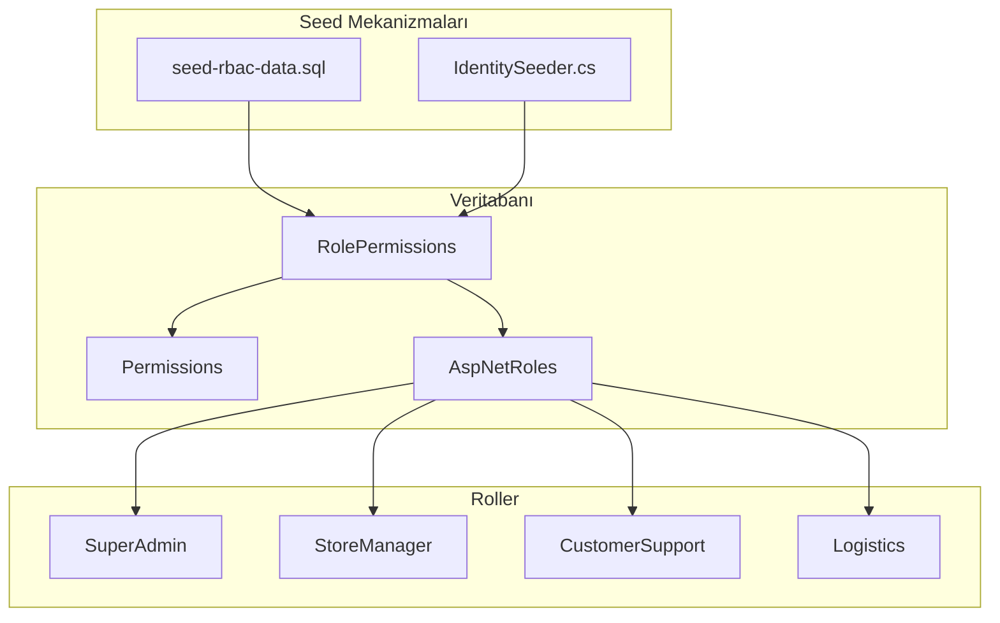

# Design Document: Role-Permission Mapping

## Overview

Bu tasarım, seed-rbac-data.sql ve IdentitySeeder.cs dosyalarındaki rol-izin eşleştirme eksikliklerini giderir. Her rol için iş gereksinimlerine uygun izin seti tanımlanır ve her iki seed mekanizması senkronize tutulur.

## Architecture



## Components and Interfaces

### 1. Rol-İzin Matrisi (Güncellenmiş)

#### SuperAdmin

Tüm izinlere sahip - değişiklik yok.

#### StoreManager (Güncellenmiş)

```sql
-- Mevcut izinlere ek olarak:
'users.view',           -- YENİ: Müşteri listesi görüntüleme
'couriers.view',        -- YENİ: Kurye listesi görüntüleme
'reports.view'          -- YENİ: Genel rapor erişimi
```

#### CustomerSupport (Güncellenmiş)

```sql
-- Mevcut izinlere ek olarak:
'reports.view',         -- YENİ: Genel rapor erişimi
'reports.sales'         -- YENİ: Satış raporları
-- NOT: reports.financial ve reports.export VERİLMEZ
```

#### Logistics (Güncellenmiş)

```sql
-- Mevcut izinlere ek olarak:
'reports.view',         -- YENİ: Genel rapor erişimi
'reports.weight'        -- YENİ: Ağırlık raporları
-- NOT: reports.financial ve reports.customers VERİLMEZ
```

### 2. seed-rbac-data.sql Güncellemesi

```sql
-- ============================================================
-- StoreManager: Ürün, Kategori, Kampanya, Stok Yönetimi
-- GÜNCELLEME: users.view, couriers.view, reports.view eklendi
-- ============================================================
IF @StoreManagerRoleId IS NOT NULL
BEGIN
    INSERT INTO RolePermissions (RoleId, PermissionId, CreatedAt)
    SELECT @StoreManagerRoleId, Id, GETUTCDATE()
    FROM Permissions
    WHERE IsActive = 1
    AND Name IN (
        -- Mevcut izinler...
        -- YENİ İZİNLER
        'users.view',
        'couriers.view',
        'reports.view'
    )
    AND NOT EXISTS (
        SELECT 1 FROM RolePermissions
        WHERE RoleId = @StoreManagerRoleId AND PermissionId = Permissions.Id
    );
END

-- ============================================================
-- CustomerSupport: Sipariş Yönetimi, Müşteri İletişimi
-- GÜNCELLEME: reports.view, reports.sales eklendi
-- ============================================================
IF @CustomerSupportRoleId IS NOT NULL
BEGIN
    INSERT INTO RolePermissions (RoleId, PermissionId, CreatedAt)
    SELECT @CustomerSupportRoleId, Id, GETUTCDATE()
    FROM Permissions
    WHERE IsActive = 1
    AND Name IN (
        -- Mevcut izinler...
        -- YENİ İZİNLER
        'reports.view',
        'reports.sales'
    )
    AND NOT EXISTS (
        SELECT 1 FROM RolePermissions
        WHERE RoleId = @CustomerSupportRoleId AND PermissionId = Permissions.Id
    );
END

-- ============================================================
-- Logistics: Kargo ve Teslimat Operasyonları
-- GÜNCELLEME: reports.view, reports.weight eklendi
-- ============================================================
IF @LogisticsRoleId IS NOT NULL
BEGIN
    INSERT INTO RolePermissions (RoleId, PermissionId, CreatedAt)
    SELECT @LogisticsRoleId, Id, GETUTCDATE()
    FROM Permissions
    WHERE IsActive = 1
    AND Name IN (
        -- Mevcut izinler...
        -- YENİ İZİNLER
        'reports.view',
        'reports.weight'
    )
    AND NOT EXISTS (
        SELECT 1 FROM RolePermissions
        WHERE RoleId = @LogisticsRoleId AND PermissionId = Permissions.Id
    );
END
```

### 3. IdentitySeeder.cs Güncellemesi

```csharp
// StoreManager izinleri
private static readonly string[] StoreManagerPermissions = new[]
{
    // Dashboard
    Permissions.Dashboard.View,
    Permissions.Dashboard.ViewStatistics,
    Permissions.Dashboard.ViewRevenueChart,

    // Products - Tam yetki
    Permissions.Products.View,
    Permissions.Products.Create,
    Permissions.Products.Update,
    Permissions.Products.Delete,
    Permissions.Products.ManageStock,
    Permissions.Products.ManagePricing,

    // Categories - Tam yetki
    Permissions.Categories.View,
    Permissions.Categories.Create,
    Permissions.Categories.Update,
    Permissions.Categories.Delete,

    // Orders - Görüntüleme ve güncelleme
    Permissions.Orders.View,
    Permissions.Orders.ViewDetails,
    Permissions.Orders.UpdateStatus,
    Permissions.Orders.ViewCustomerInfo,

    // YENİ: Users - Sadece görüntüleme
    Permissions.Users.View,

    // YENİ: Couriers - Sadece görüntüleme
    Permissions.Couriers.View,

    // YENİ: Reports - Genel erişim
    Permissions.Reports.View,
    Permissions.Reports.ViewSales,
    Permissions.Reports.ViewInventory,

    // Campaigns, Coupons, Brands, Banners...
};

// CustomerSupport izinleri
private static readonly string[] CustomerSupportPermissions = new[]
{
    // Mevcut izinler...

    // YENİ: Reports
    Permissions.Reports.View,
    Permissions.Reports.ViewSales,
};

// Logistics izinleri
private static readonly string[] LogisticsPermissions = new[]
{
    // Mevcut izinler...

    // YENİ: Reports
    Permissions.Reports.View,
    Permissions.Reports.ViewWeight,
};
```

## Data Models

### Güncellenmiş İzin Matrisi

| Rol             | users.view | couriers.view | reports.view | reports.sales | reports.weight | reports.financial |
| --------------- | ---------- | ------------- | ------------ | ------------- | -------------- | ----------------- |
| SuperAdmin      | ✅         | ✅            | ✅           | ✅            | ✅             | ✅                |
| StoreManager    | ✅         | ✅            | ✅           | ✅            | ❌             | ❌                |
| CustomerSupport | ✅         | ❌            | ✅           | ✅            | ❌             | ❌                |
| Logistics       | ❌         | ✅            | ✅           | ❌            | ✅             | ❌                |

### İzin Kısıtlama Gerekçeleri

| Rol             | Kısıtlanan İzin            | Gerekçe                               |
| --------------- | -------------------------- | ------------------------------------- |
| StoreManager    | users.create/update/delete | Kullanıcı yönetimi SuperAdmin yetkisi |
| StoreManager    | reports.financial          | Finansal veriler hassas               |
| CustomerSupport | reports.financial          | Finansal veriler hassas               |
| CustomerSupport | reports.export             | Veri sızıntısı riski                  |
| Logistics       | reports.customers          | Müşteri gizliliği                     |
| Logistics       | reports.financial          | Finansal veriler hassas               |

## Correctness Properties

_A property is a characteristic or behavior that should hold true across all valid executions of a system-essentially, a formal statement about what the system should do. Properties serve as the bridge between human-readable specifications and machine-verifiable correctness guarantees._

### Property 1: StoreManager Write Permission Restriction

_For any_ permission in the set {users.create, users.update, users.delete, couriers.create, couriers.update, couriers.delete}, the StoreManager role SHALL NOT have that permission in the RolePermissions table.

**Validates: Requirements 1.4, 1.5**

### Property 2: CustomerSupport Sensitive Data Restriction

_For any_ permission in the set {reports.financial, reports.export}, the CustomerSupport role SHALL NOT have that permission in the RolePermissions table.

**Validates: Requirements 2.3, 2.4**

### Property 3: Logistics Privacy Restriction

_For any_ permission in the set {reports.financial, reports.customers}, the Logistics role SHALL NOT have that permission in the RolePermissions table.

**Validates: Requirements 3.3, 3.4**

### Property 4: Seed Script and Seeder Consistency

_For any_ role-permission mapping in seed-rbac-data.sql, the same mapping SHALL exist in IdentitySeeder.cs and vice versa.

**Validates: Requirements 4.1, 4.2**

## Error Handling

| Senaryo                              | Aksiyon                 |
| ------------------------------------ | ----------------------- |
| Seed script çalışırken rol bulunamaz | WARNING log, devam et   |
| İzin zaten atanmış                   | NOT EXISTS ile skip     |
| IdentitySeeder hata                  | Exception log, rollback |

## Testing Strategy

### Unit Tests

- Her rol için izin listesi doğrulama
- Kısıtlanan izinlerin olmadığını doğrulama

### Integration Tests

- Seed script çalıştırma ve veritabanı kontrolü
- IdentitySeeder çalıştırma ve veritabanı kontrolü
- API endpoint'lerinde izin kontrolü

### Property-Based Tests

- Property 1-3: Veritabanı sorguları ile doğrulama
- Property 4: SQL ve C# dosya karşılaştırması

**Test Framework**: xUnit (Backend), SQL Server Integration Tests
**Minimum Iterations**: 100 (property testleri için)
