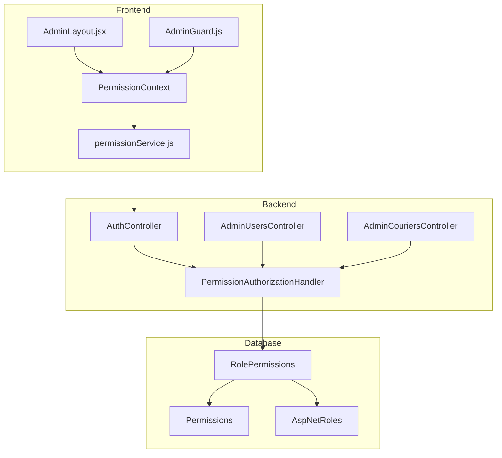

# Design Document: StoreManager Dashboard Access

## Overview

Bu tasarım, StoreManager rolünün admin paneline tam erişim sağlaması için gerekli değişiklikleri tanımlar. Mevcut durumda StoreManager, veritabanında `users.view` ve `couriers.view` izinleri eksik olduğu için bu sayfalara erişemiyor. Ayrıca AdminLayout'taki menü görünürlüğü ile route koruması arasında tutarsızlık var.

## Architecture



## Components and Interfaces

### 1. seed-rbac-data.sql Güncellemesi

StoreManager rol-izin eşleştirmesine yeni izinler eklenir:

```sql
-- StoreManager için ek izinler
INSERT INTO RolePermissions (RoleId, PermissionId, CreatedAt)
SELECT @StoreManagerRoleId, Id, GETUTCDATE()
FROM Permissions
WHERE IsActive = 1
AND Name IN (
    'users.view',      -- Kullanıcı listesi görüntüleme
    'couriers.view'    -- Kurye listesi görüntüleme
)
AND NOT EXISTS (
    SELECT 1 FROM RolePermissions
    WHERE RoleId = @StoreManagerRoleId AND PermissionId = Permissions.Id
);
```

### 2. IdentitySeeder.cs Güncellemesi

C# seeder'da aynı izinler eklenir:

```csharp
// StoreManager izinleri
private static readonly string[] StoreManagerPermissions = new[]
{
    // Mevcut izinler...
    Permissions.Users.View,      // YENİ
    Permissions.Couriers.View    // YENİ
};
```

### 3. AdminLayout.jsx Menü Filtreleme İyileştirmesi

Menü öğelerinin `adminOnly` flag'i yerine doğrudan izin kontrolü yapılır:

```javascript
// Mevcut (sorunlu)
{
    path: "/admin/users",
    label: "Kullanıcılar",
    permission: PERMISSIONS.USERS_VIEW,
    adminOnly: true,  // Bu gereksiz, permission yeterli
}

// Düzeltilmiş
{
    path: "/admin/users",
    label: "Kullanıcılar",
    permission: PERMISSIONS.USERS_VIEW,
    // adminOnly kaldırıldı - izin kontrolü yeterli
}
```

### 4. Route Koruması (App.js)

Her admin route'una `requiredPermission` eklenir:

```javascript
<Route
  path="/admin/users"
  element={
    <AdminGuard requiredPermission={PERMISSIONS.USERS_VIEW}>
      <AdminUsers />
    </AdminGuard>
  }
/>
```

## Data Models

### RolePermissions Tablosu

| Column       | Type     | Description        |
| ------------ | -------- | ------------------ |
| Id           | INT      | Primary Key        |
| RoleId       | INT      | FK to AspNetRoles  |
| PermissionId | INT      | FK to Permissions  |
| CreatedAt    | DATETIME | Oluşturulma tarihi |

### StoreManager İzin Matrisi (Güncellenmiş)

| Modül      | View | Create | Update | Delete |
| ---------- | ---- | ------ | ------ | ------ |
| Dashboard  | ✅   | -      | -      | -      |
| Products   | ✅   | ✅     | ✅     | ✅     |
| Categories | ✅   | ✅     | ✅     | ✅     |
| Orders     | ✅   | -      | ✅     | -      |
| Users      | ✅   | ❌     | ❌     | ❌     |
| Couriers   | ✅   | ❌     | ❌     | ❌     |
| Campaigns  | ✅   | ✅     | ✅     | ✅     |
| Reports    | ✅   | -      | -      | -      |

## Correctness Properties

_A property is a characteristic or behavior that should hold true across all valid executions of a system-essentially, a formal statement about what the system should do. Properties serve as the bridge between human-readable specifications and machine-verifiable correctness guarantees._

### Property 1: StoreManager Read-Only User Access

_For any_ StoreManager user and any user management operation (create, update, delete), the system SHALL return 403 Forbidden while allowing view operations to succeed with 200 OK.

**Validates: Requirements 1.3, 1.4**

### Property 2: StoreManager Read-Only Courier Access

_For any_ StoreManager user and any courier management operation (create, update, delete), the system SHALL return 403 Forbidden while allowing view operations to succeed with 200 OK.

**Validates: Requirements 2.3, 2.4**

### Property 3: Menu Visibility Matches Permissions

_For any_ user with a specific set of permissions, the AdminLayout sidebar SHALL display only menu items for which the user has the corresponding view permission.

**Validates: Requirements 3.1, 3.2, 3.3**

## Error Handling

| Senaryo             | HTTP Kodu | Mesaj                                             |
| ------------------- | --------- | ------------------------------------------------- |
| İzin yetersiz       | 403       | "Bu işlem için yetkiniz bulunmamaktadır"          |
| Oturum geçersiz     | 401       | "Oturum süresi dolmuş, lütfen tekrar giriş yapın" |
| Route erişim engeli | 302       | Dashboard'a yönlendirme + toast mesajı            |

## Testing Strategy

### Unit Tests

- AdminLayout menü filtreleme fonksiyonu
- checkPermission helper fonksiyonu
- AdminGuard component render testi

### Integration Tests

- StoreManager token ile /api/admin/users GET → 200
- StoreManager token ile /api/admin/users POST → 403
- StoreManager token ile /api/admin/couriers GET → 200
- StoreManager token ile /api/admin/couriers POST → 403

### Property-Based Tests

- Property 1: StoreManager user operations (fast-check ile)
- Property 2: StoreManager courier operations (fast-check ile)
- Property 3: Menu visibility (React Testing Library ile)

**Test Framework**: Jest + React Testing Library (Frontend), xUnit (Backend)
**PBT Library**: fast-check (JavaScript)
**Minimum Iterations**: 100
