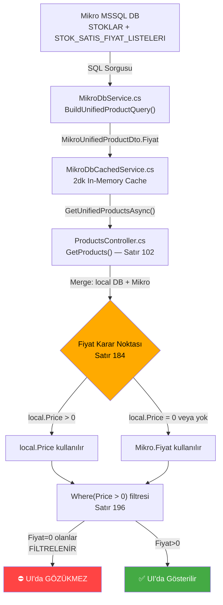
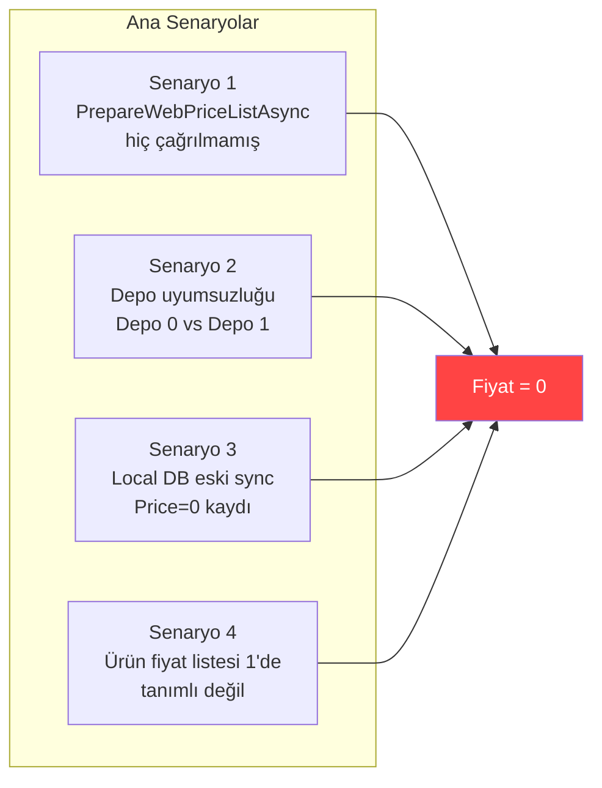

# 🔍 Fiyat = 0 Bug Analizi & Düzeltme Planı

> [!CAUTION]
> Bu rapor sadece analiz ve plan içerir. **Hiçbir kod değiştirilmemiştir.**

---

## 1. Veri Akışı Haritası (DB → UI)

Ürünlerin Mikro ERP'den kullanıcı ekranına ulaşana kadar geçtiği tüm katmanlar:



---

## 2. Tespit Edilen 7 Kırılma Noktası

### 🔴 KRİTİK SORUN #1: `PrepareWebPriceListAsync` Çalışmamış Olabilir

**Dosya:** [MikroDbService.cs](file:///c:/Users/GAMZE/Desktop/eticaret/src/ECommerce.Infrastructure/Services/MicroServices/MikroDbService.cs#L328-L471)

**Problem:**
- `PrepareWebPriceListAsync()` **liste 11**'e fiyat yazar (kaynak liste 1'den kopyalar)
- `BuildUnifiedProductQuery()` **önce liste 11**'e bakar (satır 491-527)
- Eğer `PrepareWebPriceListAsync` hiç çalışmamışsa → Liste 11 boştur → `Hedef.sfiyat_fiyati = NULL`
- **Fallback mevcuttur** (satır 529-535, kaynak liste 1'den `MAX(sfiyat_fiyati)` alır)

**AMA:** Fallback sorgusunda `sfiyat_deposirano = 1` filtresi var (satır 533). Eğer bazı ürünlerin fiyatı sadece **Depo 0** veya başka bir depoda tanımlıysa → fallback da 0 döner!

```sql
-- Sorunlu fallback filtresi:
WHERE sfiyat_listesirano = 1
  AND sfiyat_deposirano  = 1   -- ⚠️ Sadece Depo 1'i kontrol eder
```

**Etki:** Depo 1 dışında fiyat tanımı olan ürünler → Fiyat = 0 döner

---

### 🔴 KRİTİK SORUN #2: Local DB Price Override Hatası

**Dosya:** [ProductsController.cs](file:///c:/Users/GAMZE/Desktop/eticaret/src/ECommerce.API/Controllers/ProductsController.cs#L184)

**Problem:**
```csharp
Price = hasLocal && local!.Price > 0 ? local.Price : p.Fiyat,  // Satır 184
```

Eğer local DB'de bir ürün kaydı varsa (`hasLocal = true`) ve bu ürünün `Price = 0` ise:
1. `local.Price > 0` → **false** olur
2. Dolayısıyla `p.Fiyat` (Mikro fiyatı) kullanılır → Bu kısım doğru çalışır

**AMA** asıl problem:
- Local DB'deki ürün **eski sync** ile `Price = 0` olarak kaydedilmiş olabilir
- `AutoCategorize` endpointi çağrıldığında (satır 328): `local.Price = mikro.Fiyat` → Eğer o an Mikro'dan 0 gelirse → local DB'ye 0 yazılır → Daha sonra Mikro düzelse bile local DB **0'da kalır**

---

### 🟡 ÖNEMLİ SORUN #3: Fiyat Listesi Numarası Uyumsuzluğu

**Dosya:** [MikroDbService.cs](file:///c:/Users/GAMZE/Desktop/eticaret/src/ECommerce.Infrastructure/Services/MicroServices/MikroDbService.cs#L487-L552)

| Yer | Kullanılan Liste No | Depo No |
|-----|---------------------|---------|
| `BuildUnifiedProductQuery()` default | **11** (hedef) + **1** (fallback) | **0** |
| `PrepareWebPriceListAsync()` hedef | **11** | **0** |
| `PrepareWebPriceListAsync()` kaynak | **1**, Depo **1** | — |
| `BuildSqlPriceQuery()` default | **11** | — |
| `HotPoll.ExecutePollCycleAsync()` | `fiyatListesiNo: 1` ❗ | `depoNo: 0` |
| Delta fallback | **1**, Depo **yok** (tüm depolar) | — |

**Uyumsuzluk:** HotPoll `fiyatListesiNo: 1` gönderiyor (satır 175-176) ama `BuildDeltaChangedProductQuery` bunu `hedefListe` olarak kullanıyor → Hedef liste **1** olur, kaynak da **1** → Aynı listeden okuyup aynı listeye yazıyor — bu durumda fallback'e düşmez ama **Depo filtresi tutarsız** (delta'da depo filtresi yok, ana sorguda Depo 1 var).

---

### 🟡 ÖNEMLİ SORUN #4: `MikroProductCache.SatisFiyati` Senkron Dışı Kalabilir

**Dosya:** [MikroHotPollBackgroundService.cs](file:///c:/Users/GAMZE/Desktop/eticaret/src/ECommerce.Business/Services/Sync/MikroHotPollBackgroundService.cs#L273-L281)

HotPoll delta güncelleme yaparken:
```csharp
if (cache.SatisFiyati != mikro.Fiyat)  // Satır 274
{
    cache.SatisFiyati = mikro.Fiyat;   // Satır 278 — mikro.Fiyat 0 olabilir!
}
```

Eğer mikro'dan 0 gelirse → Cache'e 0 yazılır → `SyncCacheToProductTableAsync` çalışırsa → Product.Price'ı da 0 yapabilirdi **AMA** orada `> 0` koruması var (satır 816):
```csharp
if (cache.SatisFiyati > 0 && product.Price != cache.SatisFiyati)  // ✅ Koruma var
```

Bu durumda cache'de 0 kalır ama Product tablosuna yansımaz. **Ancak cache verisini okuyan başka servisler etkilenir.**

---

### 🟡 ÖNEMLİ SORUN #5: `GetProducts()` → `Where(Price > 0)` Filtresi

**Dosya:** [ProductsController.cs](file:///c:/Users/GAMZE/Desktop/eticaret/src/ECommerce.API/Controllers/ProductsController.cs#L196)

```csharp
.Where(x => x.Product.Price > 0); // Satır 196 — Fiyatsız ürünleri gösterme
```

Bu filtre **amaçlanan davranıştır** (fiyatı 0 olan ürünler gösterilmemeli). Ama sorun bu filtrenin çalışması değil — sorun fiyatın **neden 0 geldiği**.

---

### 🟠 ORTA SORUN #6: `GetProductsByCategoryPaged` Farklı Yoldan Çalışır

**Dosya:** [ProductsController.cs](file:///c:/Users/GAMZE/Desktop/eticaret/src/ECommerce.API/Controllers/ProductsController.cs#L468-L489)

`category/{categoryId}/paged` endpoint'i `ProductManager.GetProductsByCategoryPagedAsync()` çağırır. Bu metod:
- **Mikro ERP'ye hiç bakmaz** → Doğrudan local DB'den `Product` tablosundan okur
- Local DB'deki `Product.Price` = 0 ise → Kullanıcıya 0 gösterir (filtre yok)

Bu endpoint kullanılıyorsa ve local DB'de eski sync verisi 0'sa → Sorun direkt görünür.

---

### 🟠 ORTA SORUN #7: `BuildSqlPriceQuery` Fallback Eksikliği

**Dosya:** [MikroDbService.cs](file:///c:/Users/GAMZE/Desktop/eticaret/src/ECommerce.Infrastructure/Services/MicroServices/MikroDbService.cs#L558-L584)

`GetFiyatSatirlariAsync` → `BuildSqlPriceQuery`:
```sql
ISNULL(Hedef.sfiyat_fiyati, 0)  AS fiyat   -- Satır 567
```
Bu sorguda **fallback JOIN yok** (birleşik sorgudaki gibi kaynak liste fallback'i). Liste 11'de satır yoksa → direkt 0 döner.

---

## 3. Kök Neden Özeti



---

## 4. Düzeltme Planı (Adım Adım)

### ADIM 1: Tanı — Hangi Ürünler 0 Geliyor?
> **Öncelik: 🔴 KRİTİK**

- [ ] Logları incele: `[MikroDbService] Birleşik ürün sorgusu tamamlandı. Toplam: X, Fiyat>0: Y, Stok>0: Z`
  - Y'nin X'ten küçük olduğu durumları tespit et
- [ ] Hangi SKU'lar için fiyat 0 geliyor, bunları listele
- [ ] Bu ürünlerin Mikro DB'de **hangi fiyat listesinde** ve **hangi depoda** fiyatları tanımlı, SQL ile kontrol et:
  ```sql
  SELECT sfiyat_stokkod, sfiyat_listesirano, sfiyat_deposirano, sfiyat_fiyati
  FROM STOK_SATIS_FIYAT_LISTELERI
  WHERE sfiyat_stokkod IN ('SORUNLU-SKU-1', 'SORUNLU-SKU-2')
  ORDER BY sfiyat_stokkod, sfiyat_listesirano, sfiyat_deposirano
  ```

### ADIM 2: `PrepareWebPriceListAsync` Çağrısını Garanti Et
> **Öncelik: 🔴 KRİTİK**

- [ ] Bu metodun **ne zaman** ve **kim tarafından** çağrıldığını tespit et
- [ ] Startup veya periyodik bir job ile otomatik çalışmasını sağla (Hangfire/HostedService)
- [ ] Çalıştıktan sonra logda `Silinen: X, Eklenen: Y, Güncellenen: Z` çıktısını doğrula
- [ ] Z = 0 ise → Kaynak liste (1) + Depo (1) filtresi uyumsuz, Depo filtresini kaldır veya genişlet

### ADIM 3: Depo Filtresi Uyumsuzluğunu Düzelt
> **Öncelik: 🔴 KRİTİK**

Aşağıdaki 3 yerdeki depo filtrelerinin **tutarlı** olması gerekiyor:

| Dosya | Satır | Mevcut | Öneri |
|-------|-------|--------|-------|
| `PrepareWebPriceListAsync` UPDATE | 418 | `sfiyat_deposirano = 1` | Depo 0 veya tüm depolar da dahil et |
| `BuildUnifiedProductQuery` Kaynak | 533 | `sfiyat_deposirano = 1` | Depo filtresini kaldır veya config'den oku |
| `BuildDeltaChangedProductQuery` | 847-851 | Depo filtresi **yok** ✅ | Tutarlı — değiştirme |

- [ ] Mikro DB'de hangi depoda fiyat tanımlandığını tespit et
- [ ] Fiyat depo filtresini tutarlı hale getir (önerilen: tüm depolardan MAX fiyat al)

### ADIM 4: Local DB'deki 0 Fiyatlı Ürünleri Temizle
> **Öncelik: 🟡 ÖNEMLİ**

- [ ] Local DB'deki `Product.Price = 0` olan kayıtları tespit et:
  ```sql
  SELECT Id, SKU, Name, Price FROM Products WHERE Price = 0 AND IsActive = 1
  ```
- [ ] Bu ürünlerin Mikro'daki güncel fiyatları ile güncelle (tek seferlik migration veya admin endpoint)
- [ ] `AutoCategorize` ve `HotPoll`'da `Price = 0` yazılmasını engelleyen guard ekle

### ADIM 5: HotPoll `fiyatListesiNo` Parametresini Düzelt
> **Öncelik: 🟡 ÖNEMLİ**

**Dosya:** [MikroHotPollBackgroundService.cs](file:///c:/Users/GAMZE/Desktop/eticaret/src/ECommerce.Business/Services/Sync/MikroHotPollBackgroundService.cs#L173-L177)

```csharp
var changedProducts = await dbService.GetDeltaChangedProductsAsync(
    since,
    fiyatListesiNo: 1,   // ⚠️ Bu, hedef listeyi 1 yapar — ama fiyatlar liste 11'e yazılıyor
    depoNo: 0,
    cancellationToken);
```

- [ ] `fiyatListesiNo: null` veya `fiyatListesiNo: 11` yapılmalı (BuildDeltaChangedProductQuery default=11 kullanır)
- [ ] Alternatif: `fiyatListesiNo: 1` geçiliyorsa, delta sorgusundaki fallback'in doğru çalıştığından emin ol

### ADIM 6: `GetProductsByCategoryPaged` Mikro Fiyat Zenginleştirmesi
> **Öncelik: 🟠 ORTA**

- [ ] Bu endpoint local DB'den okuyor ama Mikro'daki güncel fiyata bakmıyor
- [ ] `GetProducts()` gibi Mikro ERP merge mantığı eklenmeli **veya**
- [ ] Local DB'deki fiyatların her zaman güncel olması garanti altına alınmalı (Adım 2-4 tamamlanırsa yeterli)

### ADIM 7: `BuildSqlPriceQuery`'ye Fallback Ekle
> **Öncelik: 🟢 DÜŞÜK**

- [ ] `BuildUnifiedProductQuery`'deki COALESCE fallback mantığını `BuildSqlPriceQuery`'ye de taşı
- [ ] Hedef listede yoksa kaynak listeden oku

---

## 5. Ek Eksikler Listesi (Sistem Taraması Sonucu)

| # | Eksik | Dosya | Etki | Öncelik |
|---|-------|-------|------|---------|
| 1 | `PrepareWebPriceListAsync` otomatik çağrılmıyor | MikroDbService | Fiyat listesi 11 boş kalır | 🔴 |
| 2 | Depo filtresi tutarsızlığı (0 vs 1) | MikroDbService | Bazı ürünlerde fiyat 0 | 🔴 |
| 3 | HotPoll yanlış `fiyatListesiNo: 1` gönderiyor | HotPollBackgroundService | Delta fiyat sorgusunda yanlış liste | 🟡 |
| 4 | `AutoCategorize` fiyat 0 koruması yok | ProductsController:328 | Local DB'ye 0 yazılır | 🟡 |
| 5 | `HotPoll` fiyat 0 koruması yok | HotPollBackgroundService:278 | Cache'e 0 yazılır | 🟡 |
| 6 | `GetProductsByCategoryPaged` Mikro merge yok | ProductManager | Eski fiyat gösterilir | 🟠 |
| 7 | `BuildSqlPriceQuery` fallback yok | MikroDbService | Tek kaynak fiyat sorgusu 0 dönebilir | 🟢 |
| 8 | Cache invalidation sonrası stale data riski | MikroDbCachedService | 2dk boyunca eski veri | 🟢 |
| 9 | `MikroProductCacheService` warmup lock race condition | MikroProductCacheService | İlk yüklemede paralel istek sorunu | 🟢 |

---

## 6. Önerilen Uygulama Sırası

```
1. ADIM 1 — Tanı çalışması (hangi ürünler, hangi depo)     ← 1 saat
2. ADIM 3 — Depo filtresi düzeltmesi                        ← 30 dk
3. ADIM 2 — PrepareWebPriceList otomatik çağrısı            ← 1 saat
4. ADIM 5 — HotPoll fiyatListesiNo düzeltmesi               ← 15 dk
5. ADIM 4 — Local DB temizliği + guard ekleme                ← 1 saat
6. ADIM 6 — Category paged Mikro zenginleştirme (opsiyonel)  ← 2 saat
7. ADIM 7 — BuildSqlPriceQuery fallback (düşük öncelik)      ← 30 dk
```

> [!IMPORTANT]
> **En olası kök neden:** Depo filtresi tutarsızlığı (Sorun #1 ve #3). Fiyat, Mikro DB'de **Depo 0** veya **Depo 2** gibi bir depoda tanımlıysa, mevcut SQL sorgusu sadece **Depo 1**'e baktığı için fiyat = 0 döner. Bunu doğrulamak için ADIM 1'deki SQL sorgusunu çalıştırmanız yeterli.
